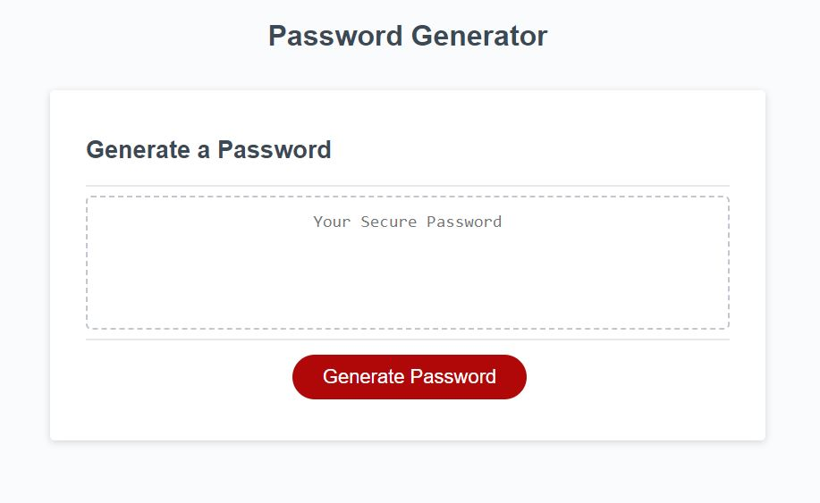
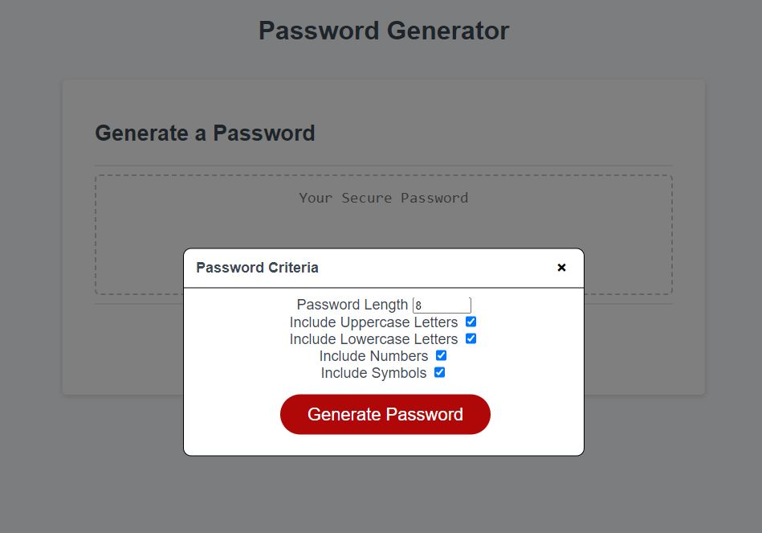
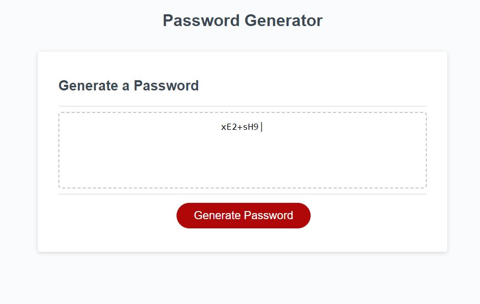

# Password-Generator

## Description

The purpose of this project was to deploy our new knowledge of Javascript to write a code that will distribute a random password using Math.random based on criteria given. I used a bootstrap modal to visualize the given criteria. 

This homework has helped me understand more about the use functions as well as how use utilize DOM elements.

## Usage

## Sources
<ul>
    <li>
        <a href="https://www.w3schools.com/howto/howto_css_modals.asp">w3schools</a>
    </li>
</ul>

## License

Refer to license in the repository.